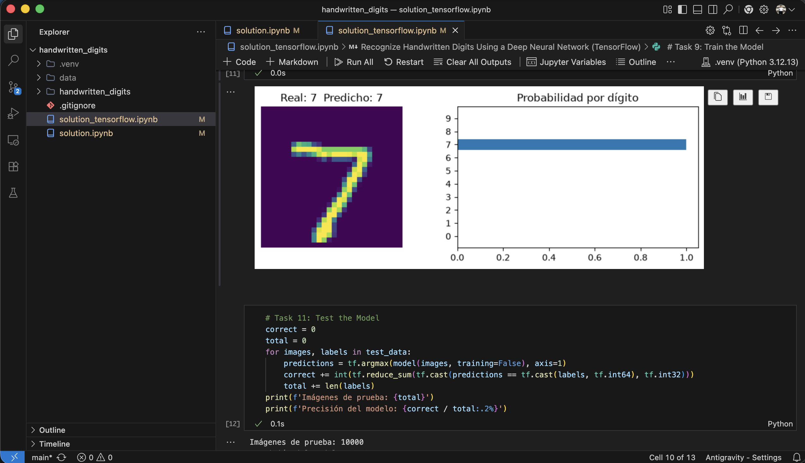
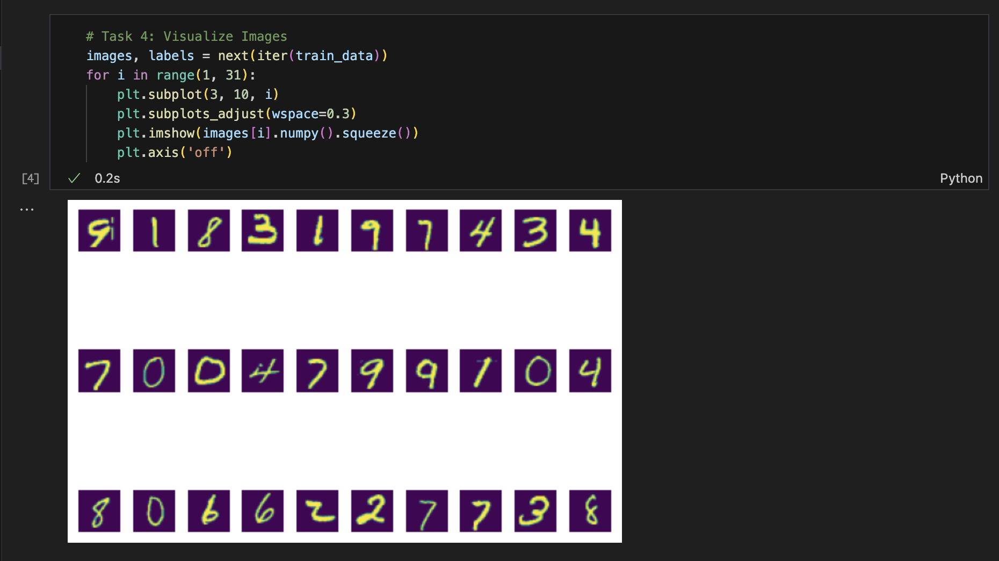

# Recognize Handwritten Digits Using a Deep Neural Network

A fully connected neural network that classifies the handwritten digits of the [MNIST](https://en.wikipedia.org/wiki/MNIST_database) dataset (28×28 grayscale images, digits 0–9). The same exercise is solved twice, once with PyTorch and once with TensorFlow/Keras, following the same 11 steps so the two frameworks can be compared side by side.



## Contents

| File | Description |
|---|---|
| `solution.ipynb` | PyTorch solution: `torchvision` transforms and `DataLoader`, an `nn.Sequential` model, `CrossEntropyLoss` and plain SGD. |
| `solution_tensorflow.ipynb` | TensorFlow/Keras solution: `tf.data` pipeline, a `keras.Sequential` model, `SparseCategoricalCrossentropy` and SGD with momentum, trained with a custom `GradientTape` loop. |
| `screenshots/` | Screenshots of the notebooks running. |

## Steps

Both notebooks follow the same tasks:

1. Import modules.
2. Create a transformation that scales pixels from 0–255 to the range −1 to 1 (`ToTensor()` + `Normalize((0.5,), (0.5,))` in PyTorch, a NumPy function in TensorFlow).
3. Download MNIST (60,000 training and 10,000 test images) and load it in batches of 64.
4. Visualize a batch of training images.
5. Define the size of each layer.
6. Build the model: 784 inputs → two hidden ReLU layers → 10 outputs (one logit per digit).
7. Compute the cross-entropy loss.
8. Create the stochastic gradient descent optimizer.
9. Train the model.
10. Predict the label of a single test image.
11. Measure accuracy on the full test set.



## Results

| | PyTorch | TensorFlow |
|---|---|---|
| Hidden layers | 64 → 32 | 128 → 64 |
| Optimizer | SGD, lr 0.1 | SGD, lr 0.003, momentum 0.9 |
| Epochs | 20 | 15 |
| Test accuracy | 96.75% | 97.34% |

Accuracy changes slightly between runs because the weights are initialized randomly and the training data is shuffled.

## How to run it

### Environment

Python 3.12 with [uv](https://docs.astral.sh/uv/). Both frameworks live in the same virtual environment:

```bash
uv venv --python 3.12
uv pip install --python .venv/bin/python torch torchvision tensorflow matplotlib numpy ipykernel
```

### Notebooks

Open either notebook with the `.venv` kernel and run the cells in order. The first run downloads MNIST: PyTorch saves it under a local `data/` folder (ignored by git) and Keras caches it in `~/.keras/datasets/`.

## Notes

| Error | Cause | Fix |
|---|---|---|
| `OSError: [Errno 30] Read-only file system: '/bytefiles'` | The original course used an absolute path at the filesystem root, which is read-only on macOS. | Use a relative path such as `'data'`. |
| `'_SingleProcessDataLoaderIter' object has no attribute 'next'` | Recent PyTorch versions removed the iterator's `.next()` method. | Use `next(iter(train_data))`. |
